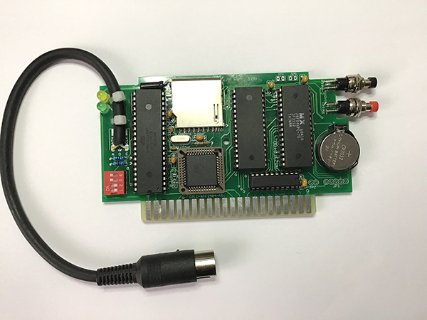

## Final Expansion FE3 for Commodore VIC-20 / VC-20 | PCB Eagle / Gerber

### Info Final Expansion FE3
* EN: http://sleepingelephant.com/denial/wiki/index.php?title=Final_Expansion  
(The schematic of the FE3 is available and the firmware is open source) 
* DE: https://oe7twj.at/index.php?title=Final_Expansion_3 
(Die Pläne für die FE3 sind frei erhältlich und die Software ist Open Source)
    
    
### Parts    
[Parts plan](images/FE3_V3_REV10c.pdf)

3x BAT85    
    
7x 100nF Ceramic    
2x 33/27pF Ceramic    
1x 22pF Ceramic	    
1x 22µF Electrolytic    
    
2x 470 Ω    
5x 1,8 kΩ    
3x 3,3 kΩ    
3x 10 kΩ    
    
1x ATMEGA1284P 5V DIL40    
1x AM29F040B DIL32    
1x SRAM 628512 DIL32    
1x 74LS245N DIL20    
1x PCF8583P DIL08    
1x ATF1504-AS CPLD PLCC44    
1x 3V REG. LD1117S33CTR SOT223    
    
1x 8.000MHz HC49U-V crystal    
1x 32.768kHz TC26H crystal     
    
1x LED 3mm Green    
1x LED 3mm Yellow      
1x Taster Red    
1x Taster Green    
1x 4 pin dip switch    
1x MAS60 Connector male & cable [Pnout](https://www.c64-wiki.com/wiki/Serial_Port)    
1x Battery 2032    
1x Battery 2032 Holder    
1x SD Card Connector  
      
1x IC Socket DIL40    
2x IC Socket DIL32    
1x IC Socket DIL20    
1x IC Socket PLCC44

### Jumper
**JP1** AS1504AS Volt select 3-2=5V / 1-2=3.3V      
**JP4** SD2IEC Disk up switch    
**JP5** SD2IEC Disk down switch      
    
### ATF1504-AS – CPLD Files
https://github.com/ops/FE3-Firmware/tree/master/cpld    
    
### ATMEGA1284P – SD2IEC Firmware         
Info EN: https://www.c64-wiki.com/wiki/SD2IEC   
Info DE: https://www.c64-wiki.de/wiki/SD2IEC    
Files: https://sd2iec.de    
1. **newboot-?*?-larsp-m1284p.hex** program to ATMEGA1284P  
2. **sd2iec-?*?-larsp-m1284p.bin** copy on SD-Card and SD2IEC will load/update the Firmware by power on

### AM29F040B – FE3 Firmware 
https://ops.github.io/FE3-Firmware/
1. Copy files (min. fe3flash.prg & fe3firmware) on SD-Card
2. Start fe3flash.prg on VIC-20
